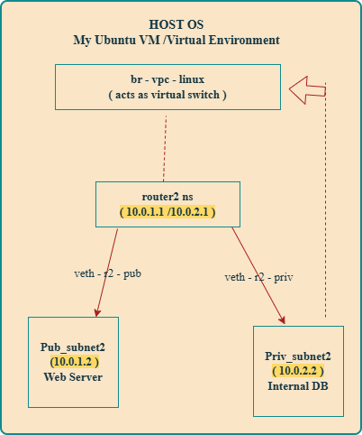
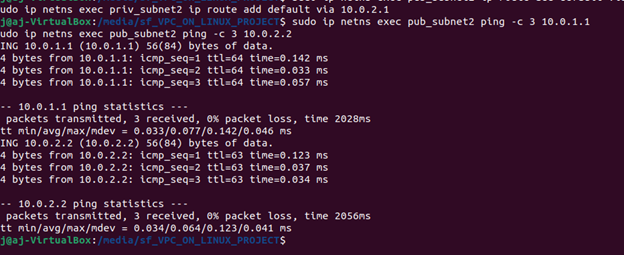
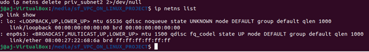

# Build Your Own Virtual Private Cloud (VPC) on Linux

## 👩🏽‍💻 Author: Ajara Amadu

## Associate Cloud Trainer | AWS Cloud Computing | DevOps Intern
________________________________________

## 📜 Project Overview

This project demonstrates how to build a Virtual Private Cloud (VPC) from scratch on a Linux system using network namespaces, virtual Ethernet pairs (veth), and routing.
It simulates AWS-style public and private subnets, routing, and isolation — all without using cloud resources.
________________________________________

 ## 🏗️ Architecture Diagram

   
________________________________________
## ⚙️ Key Components

### Component	Description

- #### Router Namespace:	Acts as the virtual router connecting subnets

- #### Public Subnet:Simulates instances with internet access

- #### Private Subnet:	Simulates isolated internal instances

- #### veth pairs: Used as virtual network interfaces between namespaces
- #### IP Routing:	Manages communication and packet forwarding
- #### HTTP Server Running: Demonstrates service accessibility between subnets
________________________________________
## 🚀 Project Steps

### 1️⃣ Create Network Namespaces

sudo ip netns add router2
sudo ip netns add pub_subnet2
sudo ip netns add priv_subnet2

### 2️⃣ Create and Link Virtual Ethernet (veth) Interfaces
sudo ip link add veth-pub2 type veth peer name veth-r2-pub
sudo ip link add veth-priv2 type veth peer name veth-r2-priv

### 3️⃣ Assign Interfaces to Namespaces

sudo ip link set veth-pub2 netns pub_subnet2
sudo ip link set veth-r2-pub netns router2
sudo ip link set veth-priv2 netns priv_subnet2
sudo ip link set veth-r2-priv netns router2

### 4️⃣ Configure IP Addresses

sudo ip netns exec pub_subnet2 ip addr add 10.0.1.2/24 dev veth-pub2
sudo ip netns exec priv_subnet2 ip addr add 10.0.2.2/24 dev veth-priv2
sudo ip netns exec router2 ip addr add 10.0.1.1/24 dev veth-r2-pub
sudo ip netns exec router2 ip addr add 10.0.2.1/24 dev veth-r2-priv

### 5️⃣ Bring Up Interfaces

for ns in router2 pub_subnet2 priv_subnet2; do
  sudo ip netns exec $ns ip link set lo up
done

sudo ip netns exec pub_subnet2 ip link set veth-pub2 up
sudo ip netns exec router2 ip link set veth-r2-pub up
sudo ip netns exec priv_subnet2 ip link set veth-priv2 up
sudo ip netns exec router2 ip link set veth-r2-priv up

### 6️⃣ Enable Packet Forwarding

sudo ip netns exec router2 sysctl -w net.ipv4.ip_forward=1

### 7️⃣ Add Default Routes

sudo ip netns exec pub_subnet2 ip route add default via 10.0.1.1
sudo ip netns exec priv_subnet2 ip route add default via 10.0.2.1

### 8️⃣ Test Connectivity

sudo ip netns exec pub_subnet2 ping -c 3 10.0.1.1
sudo ip netns exec pub_subnet2 ping -c 3 10.0.2.2

### 9️⃣ Run a Simple HTTP Server (Public Subnet)

sudo ip netns exec pub_subnet2 python3 -m http.server 80

### 🔟 Access from Private Subnet

sudo ip netns exec priv_subnet2 curl http://10.0.1.2
✅ Successful output means routing and communication work correctly!
________________________________________
## 🧹 Clean Teardown

### Stop running processes
sudo pkill -f "python3 -m http.server"

### Delete veth pairs
sudo ip link delete veth-pub2 2>/dev/null
sudo ip link delete veth-r2-pub 2>/dev/null
sudo ip link delete veth-priv2 2>/dev/null
sudo ip link delete veth-r2-priv 2>/dev/null

### Delete namespaces
 
for ns in pub_subnet2 priv_subnet2 router2; do
  sudo ip netns delete $ns 2>/dev/null
done
________________________________________

## 📸 Screenshots

### Description	Screenshot

VPC Architecture	
- ### Architectural Diagram:
  
  
- ### Subnet Isolation Test 
   
  	
- ### Clean Teardown
 
________________________________________
## 🎥 Demo Video

📽️ Watch the full VPC simulation demo:

  ### 👉 Demo Video

________________________________________

## 🗂️ Repository Contents

VPC_ON_LINUX_PROJECT/
│
├── README.md
├── vpcctl
├── vpcctl.sh
└── screenshots/
    ├── architecture-diagram.png
    ├── testing-network-between-namespaces.png
    ├── isolation-test.png
    ├── cleanup-success.png
    └── demo-video.mp4
________________________________________

## ✅ Learning Outcomes

•	Understood Linux network namespaces and veth pairs
•	Simulated public/private subnets and routing
•	Implemented VPC-style isolation
•	Practiced clean teardown and version control with GitHub
________________________________________

## 💡 Future Improvements

•	Automate full setup/teardown using a Bash script (vpcctl.sh)
•	Add NAT simulation for internet access from private subnet
•	Extend to multi-router topologies for more complex networks
________________________________________

## 🌟 Credits

This project was developed by Ajara Amadu as part of the HNG DevOps Internship — Stage 4: Build Your Own VPC on Linux.
